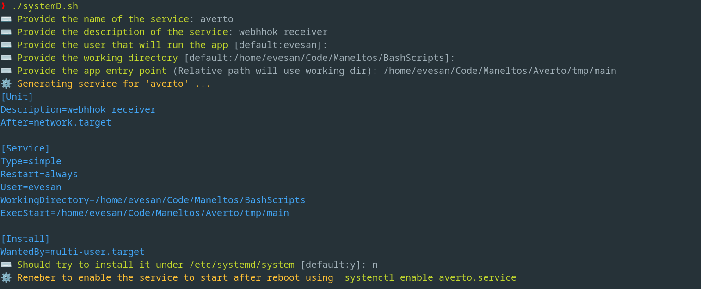

# Bash scripts

This repo contains scripts that may be helpful for several tasks.

## Index
- [systemD](#systemD)


### systemD

*This script helps creating and installing a new services based on an interactive prompt.*



**Use it remotely**

```bash
bash <(curl -s https://raw.githubusercontent.com/everitosan/BashScripts/main/systemD.sh)
```