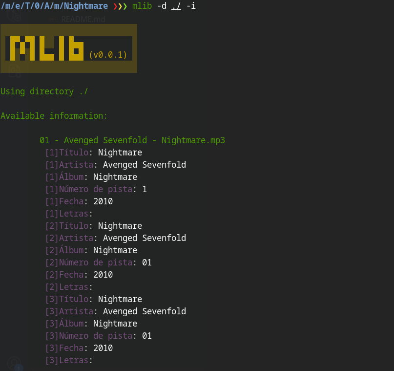
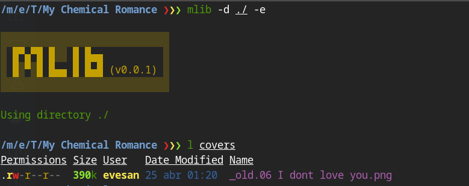
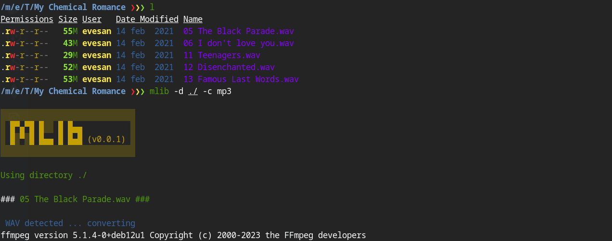

# mlib

Script to convert, extract and set tags from music files.

## Requirements
Need to be installed in the system to work correctly
- [kid3-cli](https://packages.debian.org/search?keywords=kid3-cli)
- [fzf](https://github.com/junegunn/fzf)
- [ffprobe](https://ffmpeg.org/ffprobe.html)
- [ffmpeg](https://ffmpeg.org/download.html)


## Use

**Parameters**

```bash
$ mlib -h
░░░░░░░░░░░░░░░░░░░░░░░░░░░░
░ █▀▄▀█ █░░ █ █▄▄          ░
░ █░▀░█ █▄▄ █ █▄█ (v0.0.1) ░
░░░░░░░░░░░░░░░░░░░░░░░░░░░░

  Flags:
    * -d [specifies directory to use]
      -i [shows info of a directory]
      -e [extract image covers]
      -c [convert, can convert to mp3 or wav]
      -f [fill metadata of all files of all tags in a directory]
      -g [generate info.csv file]
      -h [shows help]

  * (required)

```

### ░ Directory information ( -i )  

This option shows TAG 1, 2, and 3 of all files in a specific directory.  




### ░ Extract cover images ( -e )

You can extract image covers of all audio files in given directory. It will save them in a directory called `covers` and every image will have the name of the source file but with png ext.




### ░ Format convertion ( -c )

The script can convert from and to several containers, you only need to specify the desired output format.

|From| To |
|--|--|
| mp4 | mp3 |
| flac | mp3 |
| wav | mp3 |
| flac | wav |

