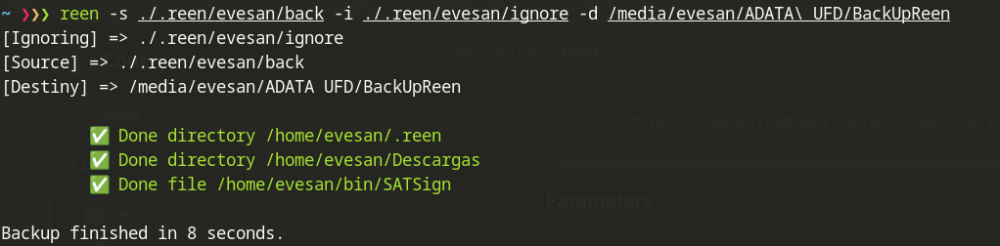

# Reen script  
Backup utility based in rsync.

| **Reen** *(Esperanto)*: back, backwards, once again.


## Install

```bash
curl  https://raw.githubusercontent.com/everitosan/BashScripts/main/reen/reen.sh -o /usr/local/bin/reen && sudo chmod 755 /usr/local/bin/reen
```

**Parameters**

```bash
$ reen -h

########################
# 🔧 🆁🅴🅴🅽 (script)  #
############### 1.0.0 #
-h - Show help
-d - Directory path for destiny of the backup
-s - File with directories to backup
-i - File with directories to be ignored in the backup

```


## Example of use


**Source file**
```txt
/home/evesan/Work
/home/evesan/Descargas
/home/evesan/bin/SATSign
```


**Ignore file**
```txt
node_modules
target
```

**Output**  

